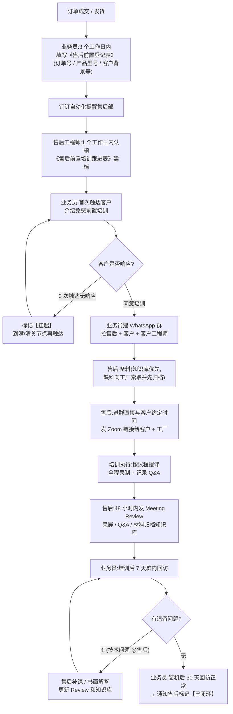
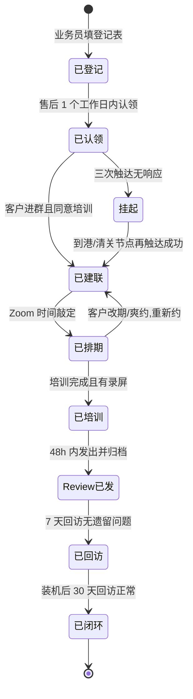

# 售后前置 SOP(主动式售后服务标准作业流程)

| 项目 | 内容 |
| --- | --- |
| 版本 | V1.0 |
| 生效日期 | 2026-07-15 |
| 归口部门 | 售后部 |
| 适用范围 | MAYA MEDICAL 全部设备订单(自产 X 光机及供应链整合产品) |
| 配套工具 | 钉钉「售后前置系统」多维表、钉钉知识库 + AI 问答、WhatsApp、Zoom、工厂微信群 |

---

## 1. 目的:为什么要做售后前置

**老流程的问题**:客户出了问题才找业务员 → 业务员填表 → 售后进群 → 转述工厂答复。整个链条是被动的、依赖工厂的,响应慢,而且同样的问题反复出现,没有沉淀成公司自己的知识体系。

**售后前置的核心思路**:把售后动作从"设备出问题之后"提前到"订单成交—海运在途—到货装机"这个窗口期。发往非洲的设备海运普遍需要 30–60 天,这段时间客户等着收货,正是做培训的黄金空窗期。

> **一句话目标:设备到客户手里之前,客户已经会用了;问题发生之前,答案已经在知识库里了。**

三个衡量标准:

1. **主动**:每一个发货订单都有人主动联系客户提供培训,而不是等客户报修。
2. **沉淀**:每一次培训、每一个问答都进知识库,喂给钉钉 AI,同样的问题不问工厂第二次。
3. **闭环**:每一条登记记录都走到"已闭环"状态,没有半途不了了之的任务。

---

## 2. 一页速览:谁在什么时候做什么

| 时间节点 | 业务端(业务员) | 售后端(售后工程师) |
| --- | --- | --- |
| 订单成交/发货后 3 个工作日内 | 填写《售后前置登记表》 | — |
| 登记后 1 个工作日内 | — | 认领任务,在《售后前置培训跟进表》建档 |
| 登记后 3 个工作日内 | 用话术模板首次触达客户,介绍前置培训服务、拿到客户同意 | 按产品型号备齐培训材料 |
| 客户同意培训后 2 个工作日内 | 建 WhatsApp 群,拉售后入群并介绍 | 进群后**直接与客户敲定培训时间**,发 Zoom 链接(同步工厂对接人) |
| 培训前 24 小时 | — | 在群里发培训提醒 + 议程 |
| 培训当天 | 视情况参加(重点客户建议参加) | 主持培训,全程录制,记录 Q&A |
| 培训后 2 个工作日内 | — | 发出 Meeting Review 给客户;材料、录屏、Q&A 归档知识库 |
| 培训后 7 天 | **群内回访**,确认客户无遗留问题 | 支持:回访中出现技术问题时进群解答 |
| 设备装机后 30 天 | **主动回访一次**,确认设备运行正常 → 通知售后闭环 | 支持:确认技术无遗留后标记【已闭环】 |

---

## 3. 角色与职责

| 角色 | 职责 | 一句话定位 |
| --- | --- | --- |
| **业务员** | 订单信息登记、客户首次触达、建群建联、物流节点同步、**培训后回访** | 客户信息的入口与关系维护人,负责"把客户带到售后面前",并在培训后回访客户 |
| **售后工程师** | 认领任务、备料、**与客户约培训时间**、授课、出 Meeting Review、归档、闭环判定 | 培训执行的责任人,负责约时间到出纪要的全部专业动作 |
| **工厂对接人** | 提供产品资料、参加/支持培训、解答深度技术问题 | 技术后盾,但资料必须先沉淀到我们自己的库里再用 |
| **售后部负责人** | 周会复盘、超时任务催办、仪表盘指标检查 | 闭环的最后一道闸 |

**责任归属原则**:登记之前的事(信息全不全、客户联系得上联系不上)归业务员;登记之后的事(培训做没做、闭环没闭环)归认领的售后工程师。中间断了链子,先看状态卡在谁手里。

---

## 4. 总流程图



---

## 5. 业务端 SOP

### 5.1 第一步:填写《售后前置登记表》(订单成交/发货后 3 个工作日内)

在钉钉「售后前置系统」→《售后前置登记表》新增记录,**以下字段为必填**:

| 字段 | 填写规范 |
| --- | --- |
| 订单号 | 与销售合同/发货单一致,一单一条记录 |
| 订单状态 | 已下单未发货 / 已发货运输中 / 已到港 / 已签收(状态变化时**及时回来更新**) |
| 售后培训的产品型号 | 上传装箱清单或产品资料附件,多型号订单逐台列明 |
| 客户姓名 | 写"决策人 + 实际使用人"两个人,只有老板联系方式的要主动问出使用人/工程师是谁 |
| 客户的国家以及城市 | 精确到城市(培训要算时差,装机要看当地条件) |
| 客户医疗器械背景 | 按 5.2 的分层标准三选一,这是售后定制培训方案的依据,**不允许空着或乱选** |
| 客户联系方式 | WhatsApp 号码为主,有邮箱一并填写 |
| 业务员 | 自己的名字,方便售后找你核对信息 |

> 建议后续在登记表中补充"预计到港时间""客户方参训人及职务""期望培训语言"三个字段,售后排期会准很多。

### 5.2 客户背景分层标准(填表时判断)

| 分层 | 判断标准 | 对售后意味着什么 |
| --- | --- | --- |
| **A:成熟医院** | 有完善医疗环境,有自己的设备科/工程师团队 | 直接对接客户工程师,做深度技术培训 |
| **B:经销商** | 买去转卖,自己承担一部分售后职能 | 目标是把经销商武装成"第一道售后",给足 FAQ 和排查手册 |
| **C:一般客户** | 有团队但不专业,或纯转售人员、对设备不了解 | 手把手基础操作培训,重点教"怎么正确报修" |

拿不准的按 C 类填,并在备注里写明情况。

### 5.3 第二步:首次触达客户(登记后 3 个工作日内)

用附录 A 的话术,通过 WhatsApp 主动联系客户,传达三件事:

1. 我们为这个订单提供**免费的**产品培训(卖点,不是负担);
2. 培训在设备海运途中就可以做,设备一到就能直接用起来;
3. 请客户提供参训人名单(尤其是实际操作设备的人/工程师)。

**三次触达原则**(防止"客户没回就不管了"):

- 第 1 次:首次消息(D0);
- 第 2 次:D+2 跟进提醒;
- 第 3 次:D+5 换通道(电话/邮件)再试一次;
- 三次无响应 → 在登记表备注"客户暂无响应",通知售后把跟进表状态改为**挂起**。挂起不等于放弃:**货物到港/清关是客户必然出现的节点**,届时业务员必须再触达一次。

### 5.4 第三步:建群建联(客户同意后 2 个工作日内)

1. 建 WhatsApp 群,命名规范:`MAYA-订单号-客户名-产品型号`(例:`MAYA-6968Y-Nnaemeka-Ultrasound`);
2. 拉入:客户决策人、客户工程师/使用人、对接的售后工程师、业务员本人;
3. 群内正式介绍售后工程师(附录 A 有介绍话术),明确"**培训时间、培训内容、技术问题**从现在起都由他/她直接与客户对接";
4. 介绍完成即交接:**与客户约培训时间、授课、发纪要由售后直接在群里完成,业务员不再居中传话**,也不需要转述任何技术内容。

### 5.5 第四步:培训后回访(培训后 7 天 + 装机后 30 天)

培训执行由售后负责,但**回访由业务员来做**——业务员是客户的对接人,由业务员出面客户更受用,也便于维护关系、捕捉商机。

- **培训后 7 天**:在 WhatsApp 群内回访(话术见附录 A),确认客户看完材料后没有新疑问;
- **装机后 30 天**:再回访一次,确认设备运行正常、操作人员已上手;客户尚未装机的,改为"到货/装机后再计 30 天",并请售后在跟进表记下预计装机时间;
- 回访中出现**技术问题**:业务员在群里 **@售后工程师** 处理,业务员负责把问题描述清楚、盯到有回应,**不自行解答技术问题**;
- 两次回访均无遗留 → 业务员通知售后,由售后做闭环判定并标记**已闭环**(判定标准见 7.2)。

### 5.6 业务端红线

- 发货订单**不登记**就是漏单,周会通报;
- 客户背景**乱填**导致售后方案错配,责任在业务端;
- 建群后业务员**不能退群**,客户后续商务问题(备件采购、增购)仍是商机入口;
- 培训后**该回访不回访**,导致遗留问题无人跟进、任务无法闭环,责任在业务端。

---

## 6. 售后端 SOP

### 6.1 第一步:认领与建档(登记表出现新记录后 1 个工作日内)

1. 售后部收到钉钉自动化提醒后,由当值/对应产品线的工程师认领;
2. 在《售后前置培训跟进表》建档,关联订单号,状态置为**已认领**;
3. 检查登记表信息完整性,缺什么(联系方式、参训人、型号附件)当天找业务员补齐。

### 6.2 第二步:备料(与业务员触达客户并行进行)

**取料顺序,严格执行:**

1. **先查钉钉知识库**:该型号的 user manual、操作视频、PPT、FAQ 是否齐全;
2. **缺什么向工厂要什么**:通过工厂微信群索取;
3. **拿到手先归档,再使用**:所有工厂给的材料,第一时间上传《售后前置产品材料收集》并同步进知识库对应产品文件夹,**然后**才发给客户或用于培训。

> 这条顺序就是"摆脱依赖工厂"的具体做法:工厂的每一次支持都要变成我们库里的存量,下一单同型号产品就不用再问了。

### 6.3 第三步:按客户分层定制培训方案

| 分层 | 培训重点 | 建议时长 | 交付物 |
| --- | --- | --- | --- |
| **A:成熟医院** | 安装环境要求、开机校准、报错代码解读、日常保养计划、易损件更换 | 60–90 分钟,可分两次 | 技术版 PPT + 保养 checklist |
| **B:经销商** | 常见故障 Top10 排查、FAQ 手册讲解、装机流程、如何做二次培训 | 60 分钟 | FAQ 手册 + 排查流程图,目标让经销商自行消化 60% 的常见问题 |
| **C:一般客户** | 开关机、基础操作、安全注意事项、清洁保养、**"遇到问题先拍视频再报修"** 的规范 | 45–60 分钟 | 简版操作卡(图多字少)+ 报修指引 |

### 6.4 第四步:排期与邀约(售后直接对接客户,不经业务员转手)

1. 进群后**由售后直接与客户在 WhatsApp 群内敲定时间**,**用双时区表述**(例:*Beijing 16:00 / Lagos 09:00, Jul 20*);业务员不再负责约时间,售后无需等业务员传话;
2. 创建 Zoom 会议,链接**同时发给客户和工厂对接人**(需要工厂技术支持的场次,提前跟工厂确认到场人员);
3. 培训前 24 小时在群内发提醒 + 议程(附录 C);
4. 常用市场时差速查(北京时间减去以下小时数即当地时间):

| 国家 | 时区 | 与北京时差 | 建议培训窗口(北京时间) |
| --- | --- | --- | --- |
| 尼日利亚 | WAT (UTC+1) | −7h | 15:00–18:00(当地 8:00–11:00) |
| 加纳 | GMT (UTC+0) | −8h | 16:00–18:00(当地 8:00–10:00) |
| 肯尼亚 / 埃塞俄比亚 / 坦桑尼亚 | EAT (UTC+3) | −5h | 14:00–18:00(当地 9:00–13:00) |
| 南非 | SAST (UTC+2) | −6h | 15:00–18:00(当地 9:00–12:00) |

### 6.5 第五步:培训执行

- 按附录 C 议程走:开场 → 产品概述 → 操作演示 → 维护保养 → Q&A → 下一步安排;
- **全程录制**(Zoom 云录制或本地录制,开场先口头告知并征得同意);
- 指定记录人(主讲之外的同事,或主讲自己会后凭录屏补记),**逐条记录 Q&A**:客户原话问题 → 现场答复 → 是否有待工厂确认的遗留项;
- 工厂人员答复的内容,记录时标注来源,这些是知识库最值钱的增量;
- 当场答不上的问题**不要含糊过去**,明确记为 Open Item,承诺书面答复时间。

### 6.6 第六步:培训后 48 小时内交付与归档

1. 按附录 D 模板整理 **Meeting Review**,发到 WhatsApp 群(PDF 优先),请客户确认收到;
2. 归档四件套进知识库对应产品文件夹:
   - 培训录屏(或云录制链接);
   - 培训用 PPT/材料终版;
   - Meeting Review;
   - **Q&A 整理进该产品的 FAQ 文档**(问题-答案-来源-日期),让钉钉 AI 能直接检索到;
3. 更新《售后前置培训跟进表》:培训日期、讲师、参训人、录屏链接、Review 发送时间,状态置为 **Review 已发**。

### 6.7 第七步:配合回访与闭环(回访主责在业务员,售后负责技术支持与闭环判定)

回访动作由业务员发起(培训后 7 天、装机后 30 天,见 5.5),售后在此环节的职责是:

- 业务员回访中 **@售后** 反馈的技术问题:及时进群解答,或按需补课/书面解答,补充进 FAQ,**并让相关回访重新计时**;
- 把 Open Item 是否已书面销项、录屏/材料/FAQ 是否已归档纳入自查;
- 收到业务员"两次回访无遗留"的通知后,按 7.2 的四条标准做**闭环判定**,达标才把状态改为**已闭环**。

---

## 7. 培训任务闭环

### 7.1 状态机(跟进表的"状态"字段统一用这套)



### 7.2 闭环判定:四个条件缺一不可

一条培训任务只有同时满足以下四条,才允许把状态改成**已闭环**:

- [ ] **培训完成有据可查**:有录屏/录制链接,有参训人记录;
- [ ] **Meeting Review 已交付**:已发给客户且客户确认收到;
- [ ] **知识已沉淀**:录屏、材料、Q&A→FAQ 均已归档知识库,钉钉 AI 可检索;
- [ ] **回访无遗留**:7 天回访 + 装机后 30 天回访均无未解决问题,Open Item 全部销项。

> 判定人:认领该任务的售后工程师自查勾选,售后部负责人周会抽查。**闭环的本质不是"培训做完了",而是"客户会用了 + 知识留下了"。**

### 7.3 超时升级机制(靠钉钉自动化,不靠人盯)

在「售后前置系统」的自动化里配置:

| 触发条件 | 自动化动作 |
| --- | --- |
| 登记表新增记录 | 提醒售后部群:有新任务待认领 |
| 记录停留在"已登记"超过 2 个工作日 | 提醒售后部负责人 |
| 停留在"已建联"超过 7 天未排期 | 提醒认领工程师 + 业务员 |
| 停留在"已培训"超过 48 小时未发 Review | 提醒认领工程师 |
| 挂起状态且订单状态变为"已到港" | 提醒业务员再次触达客户 |
| 任一状态停留超过 14 天 | 汇总进周报,周会过单 |

### 7.4 周会复盘与仪表盘指标

每周售后部例会用「仪表盘」过以下指标:

| 指标 | 定义 | 目标 |
| --- | --- | --- |
| 前置覆盖率 | 已登记订单数 ÷ 当期发货订单数 | 100%(漏单查业务端) |
| 培训完成率 | 已培训 ÷ 已登记(剔除挂起) | ≥ 80% |
| 装机前培训率 | 装机前完成首训的订单占比 | 持续提升(前置的核心指标) |
| Review 48h 达成率 | 48h 内发出 Review 的场次占比 | ≥ 90% |
| 知识入库数 | 当周新增 FAQ 条目 / 录屏 / 材料数 | 每场培训至少 1 条 FAQ 增量 |
| 重复问题率 | 知识库已有答案却仍升级到工厂的问题占比 | 逐月下降 |
| 挂起单存量 | 当前挂起状态记录数 | 每单都有下次触达计划 |

复盘三问:哪些单卡住了,卡在谁手里?本周客户问得最多的问题是什么,FAQ 里有没有?哪些问题这个月问了工厂第二遍?

### 7.5 月度知识库盘点

每月最后一周,售后部对知识库做一次盘点:

1. 主推产品的资料四件套(说明书 / 操作视频 / PPT / FAQ)是否齐全,缺的列清单向工厂催收;
2. 用钉钉 AI 实测 10 个本月客户真实问过的问题,答不准的补文档;
3. 高频问题(被问 ≥ 3 次)整理成标准答复模板,直接给业务员和经销商复用。

---

## 8. SLA 时效汇总

| # | 动作 | 责任人 | 时限 |
| --- | --- | --- | --- |
| 1 | 填写售后前置登记表 | 业务员 | 订单成交/发货后 3 个工作日 |
| 2 | 认领任务并建档 | 售后工程师 | 登记后 1 个工作日 |
| 3 | 首次触达客户 | 业务员 | 登记后 3 个工作日 |
| 4 | 建 WhatsApp 群并介绍售后 | 业务员 | 客户同意后 2 个工作日 |
| 5 | 与客户约定培训时间 | 售后工程师 | 进群后 2 个工作日内 |
| 6 | 培训材料备齐 | 售后工程师 | 排期确定前 |
| 7 | 首次培训完成 | 售后工程师 | 力争设备到港前;最晚装机前 |
| 8 | Meeting Review 发出 + 归档 | 售后工程师 | 培训后 48 小时 |
| 9 | 第一次回访 | 业务员 | 培训后 7 天 |
| 10 | 第二次回访 | 业务员 | 装机后 30 天 |
| 11 | 闭环判定并标记已闭环 | 售后工程师 | 收到"两次回访无遗留"后 |

---

## 附录 A:业务员话术模板

### A1. 首次触达(英文,WhatsApp)

> Dear [Customer Name],
>
> Thank you for choosing MAYA MEDICAL. While your [product model] is on the way, we'd like to offer you a **free online training session** — covering operation, daily maintenance and troubleshooting — so your team can start using the equipment the day it arrives.
>
> Could you let me know who will operate the equipment (doctor / technician / engineer)? Our after-sales engineer [Engineer Name] will then contact you directly to arrange a convenient time. Looking forward to your reply!

中文要点(供业务员理解):免费培训是**服务卖点**,强调"设备到货当天就能用";这一步只需拿到"谁来参训",**不用敲具体时间**——明确告诉客户售后会直接联系他约时间。

### A2. 售后工程师入群介绍(英文)

> Hi everyone, this is [Engineer Name] from MAYA MEDICAL after-sales team. He/She will be your dedicated technical contact for [product model] — **arranging the training time, running the session**, and helping with installation and any technical questions. [Engineer Name] will message you shortly about a convenient time. Feel free to reach out anytime in this group.

### A3. 无响应跟进(D+2 / D+5)

> D+2: Hi [Name], just following up on the free training for your [product model]. It takes only 1 hour online and will save your team a lot of time later. Could you let me know who will operate the equipment, so we can get it arranged?
>
> D+5(换通道,电话/邮件):Hello [Name], this is [Sales Name] from MAYA MEDICAL. I wanted to make sure you received our free training offer for your [product model] before it arrives. Just reply here and our engineer will take care of the rest.

### A4. 培训后 7 天回访(英文)

> Hi [Name], it's been a week since our training on [product model]. Has your team had any questions while reviewing the materials? A short video of any issue helps us a lot. Also, any update on the shipment/installation? We're here to help anytime.

要点:关系性回访由业务员出面;客户提到技术问题就 **@售后** 进群处理。

### A5. 装机后 30 天回访(英文)

> Hi [Name], your [product model] has been running for about a month now. Is everything working well? Any questions from the operators? If you need a refresher session for new staff, we're happy to arrange one.

要点:确认设备运行正常、操作人员上手;无问题则通知售后闭环,有增购/备件需求顺势跟进。

---

## 附录 B:售后工程师话术模板

### B1. 培训邀约确认(英文)

> Dear [Name], your training for [product model] is confirmed:
>
> 📅 Date: [Jul 20, 2026]
> 🕓 Time: 16:00 Beijing / 09:00 Lagos (1 hour)
> 🔗 Zoom: [link]
>
> Agenda: product overview → live operation demo → maintenance → Q&A. Please invite the colleagues who will operate the equipment. The session will be recorded and shared with you afterwards.

### B2. 约时间(进群后主动发起,英文)

> Hi [Name], this is [Engineer Name] from MAYA MEDICAL. I'll be running your training for [product model]. It's a 1-hour online session over Zoom. Which day and time works best for your team next week? For reference, we're available around 15:00–18:00 Beijing time (morning your side).

### B3. 培训前 24 小时提醒(英文)

> Friendly reminder: our training session for [product model] is tomorrow at 16:00 Beijing / 09:00 Lagos. Zoom link: [link]. Please test your network and join 5 minutes early. See you there!

> 回访话术(培训后 7 天 / 装机后 30 天)由业务员发起,见附录 A4、A5。

---

## 附录 C:培训议程模板(60 分钟示例)

| 时间 | 环节 | 内容 |
| --- | --- | --- |
| 0–5 min | Opening | 参会人互相介绍;告知会议将录制;确认客户端能听清、能看到画面 |
| 5–15 min | Product Overview | 产品定位、核心部件、装箱清单核对 |
| 15–35 min | Operation Demo | 开关机、基本操作流程、常用功能演示(按客户分层调整深度) |
| 35–45 min | Maintenance | 日常清洁保养、易损件、保养周期表、报错时的正确处理动作 |
| 45–55 min | Q&A | 逐条记录;答不了的标记 Open Item 并承诺书面答复时间 |
| 55–60 min | Next Steps | 明确材料何时发、Review 何时发、下次回访时间、报修流程(先拍视频→发群里) |

---

## 附录 D:Meeting Review 模板(发客户,英文)

```text
MAYA MEDICAL — Training Review

Product & Model:   [e.g. 6968Y Ultrasound System]
Order No.:         [6968Y]
Date & Time:       [Jul 20, 2026, 16:00 Beijing / 09:00 Lagos]
Attendees:
  - Customer: [names & roles]
  - MAYA MEDICAL: [engineer, sales]
  - Factory support: [name, if any]

1. Topics Covered
   - [Product overview / operation demo / maintenance ...]

2. Key Points to Remember
   - [3–8 bullet points of the most important operational notes]

3. Q&A Summary
   | # | Question | Answer | Follow-up |
   |---|----------|--------|-----------|
   | 1 | ...      | ...    | Closed / Pending (reply by [date]) |

4. Open Items
   - [Item] — Owner: [name] — Reply by: [date]

5. Materials & Recording
   - Training recording: [link]
   - User manual / slides: [attached / link]

6. Next Steps
   - Follow-up visit in this group on [date]
   - For any issue: take a short video of the problem and send it in this group.

Thank you for your time. — MAYA MEDICAL After-sales Team
```

> 内部归档时在文末加一段"内部备注":本场新增 FAQ 条目数、工厂答复要点、值得沉淀的经验,客户版删除此段。

---

## 附录 E:常见异常处理

| 场景 | 处理办法 |
| --- | --- |
| 客户始终不回复 | 走三次触达 → 挂起 → 到港/清关节点必触达;挂起单每周会上过一遍,不允许静默消失 |
| 客户时差/网络原因约不上直播培训 | 降级方案:发录播视频 + 简版操作卡,再约 30 分钟 Q&A 专场;跟进表备注"录播替代" |
| 客户临时爽约 | 群内留言表示理解并给出两个新时间选项;连续爽约 2 次转挂起,到货节点再约 |
| 工厂不配合/资料要不到 | 先用知识库已有材料开课,缺口部分列清单由售后部负责人出面向工厂对接;长期不配合的工厂上报 Nancy,作为供应商考核依据 |
| 培训中客户问了答不上的问题 | 当场记 Open Item + 承诺答复时间,会后问工厂,书面答复进群,同步进 FAQ,不允许口头带过 |
| 一个订单多台不同设备 | 按产品拆成多条培训任务分别排期闭环,登记表一单一条、跟进表一机一条 |
| 客户是经销商,终端用户另有其人 | 培训对象加上终端用户(经销商邀请);经销商单独给 FAQ 手册,鼓励其自建一线售后能力 |

---

## 附录 F:登记表/跟进表字段对照(系统配置参考)

**《售后前置登记表》(业务员填)现有字段**:订单号、订单状态、售后培训的产品型号(附件)、客户姓名、客户的国家以及城市、客户医疗器械背景。

**建议补充**:客户 WhatsApp/邮箱、业务员姓名、客户方参训人及职务、期望培训语言、预计到港时间、预计装机时间、备注。

**《售后前置培训跟进表》(售后填)建议字段**:关联订单号、认领工程师、状态(按 7.1 状态机取值)、培训日期、培训形式(直播/录播)、讲师、参训人数、录屏链接、Review 发送日期、客户确认收到(是/否)、FAQ 新增条数、7 天回访日期及结果、30 天回访日期及结果、Open Item 及销项情况、闭环日期。

**《售后前置产品材料收集》**:产品型号、材料类型(说明书/视频/PPT/FAQ/排查手册)、来源(工厂名)、收录日期、是否已同步知识库、负责人。
